# Workflow Sequence Diagram

## Overview

The workflow enables automatic task assignment and review through Jira webhooks. When tasks are moved between columns, the Orchestrator automatically routes them to appropriate AI agents based on project/team naming conventions.

> Note: In this version of the workflow, the architecture agent is not connected to the pipeline to review pr just after CI success and both agents just connected to jira to listen to task status events.

## Sequence Diagram

```plantuml
@startuml
skinparam sequenceMessageAlign center
skinparam participant {
    BackgroundColor #E8F4F8
    BorderColor #2E86AB
}
skinparam actor {
    BackgroundColor #F0F8FF
    BorderColor #003366
}

actor "Human\n(Team Member)" as Human
participant "Jira\n(Self-hosted)" as Jira
participant "Confluence\n(Document Center)" as Confluence
participant "Git\n(Repository)" as Git
participant "Orchestrator\n(Webhook Handler)" as Orchestrator
participant "Development Agent\n(OpenHands)" as DevAgent
participant "Architecture Agent\n(OpenHands)" as ArchAgent

== Task Assignment Phase ==

Human -> Jira: Move task to "Selected for Dev"\n(Label: "ai" on issue)
activate Jira

Jira -> Orchestrator: Webhook: Issue status/column changed\n(issue_key, project_key, status, labels, description)
activate Orchestrator

Orchestrator -> Orchestrator: Check if status is "Selected for Dev"\nor "To approve" AND issue has label "ai"

alt Issue has label "ai" AND (status is "Selected for Dev" OR "To approve")
    Orchestrator -> Orchestrator: Identify agent type\n(backend/web-front/app-front)
    
    Orchestrator -> Jira: Fetch issue title via MCP\nto extract project identifier
    Jira --> Orchestrator: Issue title, e.g. "[backend] Add authentication"
    
    Orchestrator -> Orchestrator: Extract project from title\nPattern: [project]\nExample: "[backend]" -> "backend"
    
    Orchestrator -> Orchestrator: Map project to repo URL\nfrom Environment Variables\n(PROJECT_REPO_backend, PROJECT_REPO_web-front, etc.)
    
    Orchestrator -> Orchestrator: Map project to team contribution rules\nfrom Environment Variables\n(TEAM_CONTRIBUTION_RULES_backend,\nTEAM_CONTRIBUTION_RULES_web-front, etc.)
    
    Orchestrator -> Orchestrator: Map project to architecture rules\nfrom Environment Variables\n(ARCHITECTURE_RULES_URL_backend,\nARCHITECTURE_RULES_backend, etc.)
    
    Orchestrator -> Confluence: Fetch ARD (Architecture Requirements)\nvia MCP Confluence tools
    activate Confluence
    Confluence --> Orchestrator: ARD document
    deactivate Confluence
    
    Orchestrator -> Confluence: Fetch PRD (Product Requirements)\nfor task via MCP Confluence tools
    activate Confluence
    Confluence --> Orchestrator: PRD document, requirements
    deactivate Confluence
    
    Orchestrator -> Orchestrator: Compile context:\n- Task description\n- Project repository URL\n- Team contribution rules (from env)\n- Architecture rules (from env)\n- ARD (from Confluence)\n- PRD (from Confluence)
    
    alt Status is "Selected for Development"
        Orchestrator -> DevAgent: Create/Assign agent\nwith role definition and full context:\n\n"Role: Senior Software Developer\nYou are a senior software developer in the {team_name} team.\nYour responsibility is to implement features and fixes\naccording to team standards, architecture requirements,\nand best practices.\n\nHandle Jira issue: {issue_key}\nStatus: Selected for Development\nTeam: {team_name}\n\nTask Description:\n{description}\n\nRepository URL:\n{repository_url}\n\nTeam Contribution Rules:\n{team_contribution_rules}\n\nArchitecture Rules:\nURL: {architecture_rules_url}\n{architecture_rules}\n\nArchitecture Requirements Document (ARD):\n{architecture_requirements}\n\nProduct Requirements Document (PRD):\n{product_requirements}\n\nInstructions:\n1. Review PRD and ARD referenced in issue description\n2. Implement according to PRD, ARD, team contribution rules,\n   architecture rules, and software development best practices\n   (clean code, proper resource usage, etc.)\n3. Update issue status to 'to approve' when complete\n\nWork in the repository: {repository_url}"
    activate DevAgent
    
    DevAgent -> Jira: Fetch issue details via MCP
    Jira --> DevAgent: Issue details, requirements
    
    DevAgent -> DevAgent: Execute task\n(Code, test, document)
    
    DevAgent -> Git: Create Pull Request\nwith implementation
    activate Git
    Git --> DevAgent: PR created, PR URL
    deactivate Git
    
        DevAgent -> Jira: Link PR to issue\nUpdate issue status\nMove to "to approve" status\nvia MCP Jira tools
        Jira --> DevAgent: Status updated, PR linked
        
        deactivate DevAgent
        
    else Status is "to approve"
        Orchestrator -> Jira: Fetch issue details via MCP\nto get task description and PR link
        Jira --> Orchestrator: Issue details, description, PR link
        
        Orchestrator -> Orchestrator: Compile review context:\n- Task description\n- Team contribution rules\n- Architecture rules (ARD)\n- Product requirements (PRD)\n- PR link
        
        Orchestrator -> ArchAgent: Trigger Architecture Review\nwith role definition and full context:\n\n"Role: Senior Software Architect\nYou are a senior software architect responsible for\nreviewing and approving pull requests.\nYou must ensure that the PR implementation follows\nall requirements and best practices.\n\nReview Jira issue: {issue_key}\nStatus: to approve\nPull Request: {pr_link}\nTeam: {team_name}\n\nTask Description:\n{description}\n\nTeam Contribution Rules:\n{team_contribution_rules}\n\nArchitecture Rules:\nURL: {architecture_rules_url}\n{architecture_rules}\n\nArchitecture Requirements Document (ARD):\n{architecture_requirements}\n\nProduct Requirements Document (PRD):\n{product_requirements}\n\nInstructions:\n1. Review the Pull Request linked to this issue\n2. Verify that the PR implementation follows all requirements:\n   - Product Requirements Document (PRD) - all requirements are met\n   - Architecture Requirements Document (ARD) - architecture guidelines are followed\n   - Team contribution rules - code style and contribution standards are adhered to\n   - Team architecture rules - architectural patterns and principles are respected\n3. Ensure the PR demonstrates best practices of software development:\n   - Clean code principles (readability, maintainability, SOLID principles)\n   - Proper resource usage (memory, CPU, network, database queries)\n   - Error handling and edge cases are properly addressed\n   - Code is well-tested and documented\n   - Security best practices are followed\n4. If the PR meets all requirements, approve it. If not, provide detailed feedback on what needs to be improved."
        activate ArchAgent
        
        ArchAgent -> Jira: Fetch issue details via MCP
        Jira --> ArchAgent: Issue details, PR link
        
        ArchAgent -> Git: Fetch Pull Request\nvia Git API/MCP
        activate Git
        Git --> ArchAgent: PR details, code changes,\ndiff, commits
        deactivate Git
        
        ArchAgent -> ArchAgent: Review PR implementation\n(Architecture compliance,\ncode quality, standards,\nbest practices)
        
        ArchAgent -> Git: Add review comments to PR\nApprove/Request Changes\nvia Git API/MCP
        activate Git
        Git --> ArchAgent: Review comments posted
        deactivate Git
        
        ArchAgent -> Jira: Update issue with review results\nAdd review summary comments\nvia MCP Jira tools
        Jira --> ArchAgent: Comments added
        
        alt Review: Rejected
            ArchAgent -> Jira: Move issue to "Selected for Dev"\nvia MCP Jira tools
            Jira --> ArchAgent: Status updated
            note right of ArchAgent: Loop back to\nDevelopment Agent\n(PR feedback in Git)
            deactivate ArchAgent
            deactivate Orchestrator
            deactivate Jira
            ... [Loop continues] ...
        else Review: Accepted
            ArchAgent -> Jira: Move issue to "Approve by Human"\nvia MCP Jira tools
            Jira --> ArchAgent: Status updated
            deactivate ArchAgent
            deactivate Orchestrator
        end
    end
    
else Issue NOT in "Selected for Dev" OR missing label "ai"
    Orchestrator -> Orchestrator: Ignore (human task)
    note right of Orchestrator: No AI agent assigned
    deactivate Orchestrator
end

deactivate Jira

== Human Approval Phase ==

Human -> Jira: Review task in "Approve by Human"
Human -> Jira: Final approval/rejection

@enduml
```




## Simplified Workflow Flow

```
┌─────────────────────────────────────────────────────────────┐
│                    JIRA BOARD COLUMNS                        │
└─────────────────────────────────────────────────────────────┘

[Selected for Dev]  →  [In Progress]  →  [Approved]  →  [Approve by Human]  →  [Done]
      ↑                    │                  │                  │
      │                    │                  │                  │
      │                    │                  │                  │
      └────────────────────┴──────────────────┴──────────────────┘
                           │                  │
                           │                  │
                    [Development Agent]  [Architecture Agent]
                           │                  │
                           │                  │
                    ┌───────┴───────┐  ┌──────┴────────┐
                    │               │  │               │
                    │  Complete     │  │  Review       │
                    │  Task         │  │  & Comment    │
                    │               │  │               │
                    └───────┬───────┘  └──────┬────────┘
                            │                 │
                            │                 │
                    ┌───────┴─────────────────┴───────┐
                    │                                   │
                    │         ORCHESTRATOR              │
                    │    (Webhook Handler & Router)    │
                    │                                   │
                    │  • Listens to Jira webhooks      │
                    │  • Fetches docs from Confluence  │
                    │  • Routes tasks to agents         │
                    │  • Manages agent lifecycle        │
                    └───────────────────────────────────┘
                                    │
                    ┌───────────────┼───────────────┐
                    │               │               │
            [Jira Webhook]  [Confluence]   [MCP Server]
            (Task Events)   (Document     (Jira/Confluence
                            Center)       API)
                            • Team Rules
                            • ARD
                            • PRD
                    
                    [Development Agent] → [Git PR] → [Architecture Agent]
                    (Creates PR)         (Code)    (Reviews PR)
```

### Workflow Steps

1. **Human Action**: Moves task to "Selected for Dev" column and adds `ai` label to the issue

2. **Webhook Trigger**: Jira sends webhook to Orchestrator
   - Event: Issue status/column changed
   - Payload: Issue key, project key, status/column, labels, description

3. **Orchestrator Processing**:
   - Checks if status/column is "Selected for Dev"
   - Checks if issue has `ai` label
   - Identifies agent type (e.g., from project name or other conventions)
   - **Extracts project identifier from issue title**:
     - Pattern: `[project]` in issue title (e.g., "[backend] Add authentication")
     - Extracts project identifier: "backend"
   - **Maps project to repository URL**:
     - Looks up `PROJECT_REPO_{project_identifier}` in environment variables
     - Example: `PROJECT_REPO_BACKEND=https://github.com/org/backend-repo`
   - **Loads from Environment Variables** (mapped by project identifier):
     - Repository URL (PROJECT_REPO_{project_identifier})
     - Team contribution rules (TEAM_CONTRIBUTION_RULES_{project_identifier})
     - Architecture rules URL (ARCHITECTURE_RULES_URL_{project_identifier})
     - Architecture rules content (ARCHITECTURE_RULES_{project_identifier})
   - **Fetches from Confluence (Document Center)**:
     - ARD (Architecture Requirements Document)
     - PRD (Product Requirements Document) for the task
   - Compiles full context with task description, repository URL, rules, and requirements
   - Creates/assigns development agent with complete context and role definition

4. **Development Agent**:
   - Receives full context (task, team rules, architecture rules, PRD, ARD)
   - Fetches additional issue details via MCP if needed
   - Implements solution following all rules and requirements
   - Creates Pull Request in Git repository
   - Links PR to Jira issue
   - Moves issue to "Approved" column

5. **Architecture Review Trigger**: Webhook fires when issue moves to "Approved"

6. **Orchestrator Processing for Review**:
   - Fetches issue details and PR link from Jira
   - **Loads from Environment Variables** (mapped by project identifier):
     - Team contribution rules (TEAM_CONTRIBUTION_RULES_{project_identifier})
     - Architecture rules URL (ARCHITECTURE_RULES_URL_{project_identifier})
     - Architecture rules content (ARCHITECTURE_RULES_{project_identifier})
   - **Fetches from Confluence (Document Center)**:
     - ARD (Architecture Requirements Document)
     - PRD (Product Requirements Document) for the task
   - Compiles full review context with role definition
   - Assigns architecture review agent with complete context

7. **Architecture Agent**:
   - Receives role definition and full context (task, rules, ARD, PRD)
   - Fetches Pull Request from Git repository
   - Reviews PR against all rules and requirements:
     - Architecture compliance
     - Code quality and standards
     - Best practices
     - Test coverage
     - PRD alignment
   - Adds review comments directly to Git PR
   - Updates Jira issue with review summary
   - **If Rejected**: Moves back to "Selected for Dev" (loop), feedback in Git PR
   - **If Accepted**: Moves to "Approve by Human"

7. **Human Final Approval**: Reviews and approves/rejects in "Approve by Human" column

## Workflow States

### Jira Board Columns

1. **Selected for Dev**: Initial state when human assigns task
2. **In Progress**: (Optional) Agent can set this during work
3. **Approved**: Agent completes work and moves here
4. **Approve by Human**: Architecture agent approves, waiting for human
5. **Done**: Human final approval

### State Transitions

```
Selected for Dev
    ↓ (Webhook: Orchestrator → Dev Agent)
[Dev Agent Working]
    ↓ (Agent completes)
Approved
    ↓ (Webhook: Orchestrator → Arch Agent)
[Arch Agent Reviewing]
    ↓
    ├─→ Rejected → Selected for Dev (Loop)
    └─→ Accepted → Approve by Human
        ↓ (Human reviews)
        └─→ Done
```

## Orchestrator Logic

### Webhook Event: Issue Moved to "Selected for Dev"

```python
import os

def handle_webhook(event):
    # Only handle when moved into "Selected for Dev" AND labeled for AI
    if event.column == "Selected for Dev" and "ai" in (event.labels or []):
        project_key = event.project_key
        
        # Determine agent type (e.g., from project name or other convention)
        agent_type = determine_agent_type(project_key)
        # agent_type: "backend", "web-front", "app-front"
        
        # Extract project identifier from issue title (format: [project])
        import re
        issue_title = event.title or event.summary
        project_match = re.search(r'\[([^\]]+)\]', issue_title)
        project_identifier = project_match.group(1) if project_match else None
        
        # Map project identifier to repository URL from environment variables
        # Format: PROJECT_REPO_{project_identifier}
        if project_identifier:
            project_env_key = project_identifier.upper().replace('-', '_')
            repo_env_var = f"PROJECT_REPO_{project_env_key}"
            repository_url = os.getenv(repo_env_var)
            
            # Map project to team contribution rules
            team_rules_env_var = f"TEAM_CONTRIBUTION_RULES_{project_env_key}"
            team_rules = os.getenv(team_rules_env_var)
            
            # Map project to architecture rules
            architecture_rules_url_env_var = f"ARCHITECTURE_RULES_URL_{project_env_key}"
            architecture_rules_env_var = f"ARCHITECTURE_RULES_{project_env_key}"
            architecture_rules_url = os.getenv(architecture_rules_url_env_var)
            architecture_rules = os.getenv(architecture_rules_env_var)
        else:
            repository_url = None
            team_rules = None
            architecture_rules_url = None
            architecture_rules = None
        
        # Fetch ARD and PRD from Confluence (Document Center) via MCP
        ard = fetch_confluence_page(
            space="ARCHITECTURE",
            title=f"ARD - {project_key}"
        )
        
        prd = fetch_confluence_page(
            space="PRODUCT",
            title=f"PRD - {event.issue_key}"
        ) or fetch_confluence_page_by_link(event.issue_key)
        
        # Compile full context with role definition
        task_description = f"""
        Role: Development Agent
        You are a development agent responsible for implementing features and fixes 
        according to team standards and architecture requirements.
        
        Handle Jira issue: {event.issue_key}
        
        Task Description:
        {event.description}
        
        Repository URL:
        {repository_url or "Not specified - check issue title format [project]"}
        
        Team Contribution Rules:
        {team_rules}
        
        Architecture Rules:
        URL: {architecture_rules_url}
        {architecture_rules}
        
        Architecture Requirements Document (ARD):
        {ard}
        
        Product Requirements Document (PRD):
        {prd}
        
        Follow all rules and requirements strictly. Work in the repository: {repository_url}
        Create a Pull Request after implementation and link it to the Jira issue.
        """
        
        # Assign to appropriate agent with full context and role definition
        assign_to_agent(agent_type, task_description)
```

### Webhook Event: Issue Moved to "Approved"

```python
import os

def handle_webhook(event):
    if event.column == "Approved":
        # Get PR link and issue details from Jira
        issue_details = fetch_jira_issue(event.issue_key)
        pr_link = issue_details.get("pr_link") or issue_details.get("pull_request_url")
        task_description = issue_details.get("description")
        project_key = issue_details.get("project_key")
        issue_title = issue_details.get("title") or issue_details.get("summary")
        
        # Extract project identifier from issue title (format: [project])
        import re
        project_match = re.search(r'\[([^\]]+)\]', issue_title)
        project_identifier = project_match.group(1) if project_match else None
        
        # Map project to team contribution rules and architecture rules from environment variables
        if project_identifier:
            project_env_key = project_identifier.upper().replace('-', '_')
            team_rules_env_var = f"TEAM_CONTRIBUTION_RULES_{project_env_key}"
            architecture_rules_url_env_var = f"ARCHITECTURE_RULES_URL_{project_env_key}"
            architecture_rules_env_var = f"ARCHITECTURE_RULES_{project_env_key}"
            team_rules = os.getenv(team_rules_env_var)
            architecture_rules_url = os.getenv(architecture_rules_url_env_var)
            architecture_rules = os.getenv(architecture_rules_env_var)
        else:
            team_rules = None
            architecture_rules_url = None
            architecture_rules = None
        
        # Fetch ARD and PRD from Confluence (Document Center) via MCP
        ard = fetch_confluence_page(
            space="ARCHITECTURE",
            title=f"ARD - {project_key}"
        )
        
        prd = fetch_confluence_page(
            space="PRODUCT",
            title=f"PRD - {event.issue_key}"
        ) or fetch_confluence_page_by_link(event.issue_key)
        
        # Compile full context with role definition
        review_description = f"""
        Role: Architecture Review Agent
        You are an architecture review agent responsible for reviewing code implementations 
        for compliance with architecture standards, code quality, and best practices.
        
        Review Jira issue: {event.issue_key}
        Pull Request: {pr_link}
        
        Task Description:
        {task_description}
        
        Team Contribution Rules:
        {team_rules}
        
        Architecture Rules:
        URL: {architecture_rules_url}
        {architecture_rules}
        
        Architecture Requirements Document (ARD):
        {ard}
        
        Product Requirements Document (PRD):
        {prd}
        
        Review the PR against all rules and requirements. Check for:
        - Architecture compliance
        - Code quality and standards
        - Best practices adherence
        - Test coverage
        - Alignment with PRD requirements
        
        Add detailed review comments to the Git PR, then update Jira with review summary.
        """
        
        assign_to_agent("architecture-review", review_description)
```

## Agent Responsibilities

### Development Agent

- **Trigger**: Task moved to "Selected for Dev" (AI project)
- **Receives from Orchestrator**:
  - Role definition (Development Agent)
  - Task description from Jira issue
  - Repository URL (mapped from project identifier in issue title)
  - Team contribution rules (from Environment Variables)
  - Architecture rules URL and content (from Environment Variables)
  - ARD (Architecture Requirements Document) (from Confluence)
  - Product Requirements Document (PRD) (from Confluence)
- **Actions**:
  - Understand role and responsibilities as Development Agent
  - Review all provided context (rules, PRD, ARD)
  - Fetch additional issue details from Jira via MCP if needed
  - Implement solution following:
    - Team contribution rules
    - Architecture requirements (ARD)
    - Product requirements (PRD)
  - Create Pull Request in Git repository
  - Link PR to Jira issue
  - Update Jira issue with progress
  - Move issue to "Approved" column when complete

### Architecture Review Agent

- **Trigger**: Task moved to "Approved" column
- **Receives from Orchestrator**:
  - Role definition (Architecture Review Agent)
  - Task description from Jira issue
  - Team contribution rules (from Environment Variables)
  - Architecture rules URL and content (from Environment Variables)
  - ARD (Architecture Requirements Document) (from Confluence)
  - Product Requirements Document (PRD) (from Confluence)
  - Pull Request link
- **Actions**:
  - Review all provided context (rules, PRD, ARD)
  - Fetch Pull Request from Git repository (code, diff, commits)
  - Review PR against all rules and requirements for:
    - Architecture compliance
    - Code quality and standards
    - Best practices adherence
    - Test coverage
    - Alignment with PRD requirements
  - Add review comments directly to Git PR (approve/request changes)
  - Update Jira issue with review summary and results
  - **If Rejected**: Move back to "Selected for Dev" (creates loop), detailed feedback in Git PR
  - **If Accepted**: Move to "Approve by Human"

## Webhook Configuration

### Jira Webhook Setup

Configure webhooks in Jira to send events to the Orchestrator:

1. **Issue Updated Event**
   - URL: `https://orchestrator.example.com/webhooks/jira`
   - Events: Issue moved, status changed
   - Payload: Issue key, project key, status, description, labels

2. **Required Events**:
   - Issue moved to "Selected for Dev"
   - Issue moved to "Approved"
   - Issue moved to "Approve by Human"

### Webhook Payload Example

```json
{
  "webhookEvent": "jira:issue_updated",
  "issue": {
    "key": "AI-BACKEND-123",
    "fields": {
      "project": {
        "key": "ai-backend"
      },
      "status": {
        "name": "Selected for Dev"
      },
      "labels": ["ai"],
      "description": "Implement user authentication API",
      "summary": "Add JWT authentication"
    }
  },
  "changelog": {
    "items": [{
      "field": "status",
      "fromString": "To Do",
      "toString": "Selected for Dev"
    }]
  }
}
```

## Error Handling

### Agent Failure

- If agent fails during execution:
  - Log error to Jira issue as comment
  - Move issue to "Selected for Dev" for retry
  - Notify human team via Jira notification

### Webhook Failure

- Implement retry mechanism
- Queue failed webhooks for reprocessing
- Log all webhook events for audit

### Network Issues

- MCP server connection failures
- Jira API timeouts
- Implement exponential backoff retry

## Implementation Notes

1. **AI Routing Convention**: Issues labeled with `ai` in the "Selected for Dev" column are automatically routed to AI agents
   - Label-based routing decouples AI behavior from project naming

2. **Agent Assignment**: Orchestrator determines agent type from project key (or other convention you define)

3. **Project Repository Mapping**: 
   - Orchestrator extracts project identifier from Jira issue title using pattern `[project]`
   - Example: Issue title "[backend] Add authentication" → extracts "backend"
   - Maps to repository URL using environment variable: `PROJECT_REPO_{project_identifier}`
   - Format: `PROJECT_REPO_BACKEND`, `PROJECT_REPO_WEB_FRONT`, etc.
   - Repository URL is included in agent context for code implementation

4. **Project-Specific Rules Mapping**: 
   - Team contribution rules and architecture rules are also mapped per project identifier
   - Format: `TEAM_CONTRIBUTION_RULES_{project_identifier}`, `ARCHITECTURE_RULES_URL_{project_identifier}`, `ARCHITECTURE_RULES_{project_identifier}`
   - Example: `TEAM_CONTRIBUTION_RULES_BACKEND`, `ARCHITECTURE_RULES_BACKEND`
   - Allows different teams/projects to have their own specific rules and guidelines
   - Project identifier is converted to uppercase with hyphens replaced by underscores

5. **Context Enrichment**: Before assigning tasks, Orchestrator loads rules from environment variables (mapped by project) and fetches documents from Confluence:
   - **From Environment Variables** (project-specific mappings):
     - **Repository URL** (PROJECT_REPO_{project_identifier}): Git repository URL for the project
     - **Team Contribution Rules** (TEAM_CONTRIBUTION_RULES_{project_identifier}): Project-specific team guidelines and contribution standards
     - **Architecture Rules URL** (ARCHITECTURE_RULES_URL_{project_identifier}): URL reference to project-specific architecture rules
     - **Architecture Rules Content** (ARCHITECTURE_RULES_{project_identifier}): Full project-specific architecture rules content
   - **From Confluence (Document Center) via MCP**:
     - **ARD** (Architecture Requirements Document): Project-specific architecture requirements
     - **PRD** (Product Requirements Document): Product requirements linked to the task
   - **Both Development and Architecture agents receive the same comprehensive context**

6. **Role Definitions**: Each agent receives a clear role definition in the prompt:
   - **Development Agent**: Defined as responsible for implementing features and fixes according to team standards
   - **Architecture Review Agent**: Defined as responsible for reviewing code for compliance with architecture standards
   - Role definitions help agents understand their responsibilities and boundaries

7. **Document Sources**:
   - **Environment Variables** (project-specific mappings, loaded directly, not from Confluence):
     - TEAM_CONTRIBUTION_RULES_{project_identifier}: Project-specific team contribution guidelines
     - ARCHITECTURE_RULES_URL_{project_identifier}: URL to project-specific architecture rules document
     - ARCHITECTURE_RULES_{project_identifier}: Full project-specific architecture rules content
   - **Confluence Document Structure** (fetched via MCP):
     - ARD: Space "ARCHITECTURE", Page "ARD - {project_key}"
     - PRD: Space "PRODUCT", Page "PRD - {issue_key}" or linked from Jira issue

8. **Loop Prevention**: Architecture agent can reject and loop back, but should include detailed feedback to prevent infinite loops

9. **Human Oversight**: All AI-approved tasks require final human approval in "Approve by Human" column

10. **MCP Integration**: All Jira and Confluence interactions use MCP tools, ensuring agents have proper access control

11. **Git Integration**: 
   - Development agents create Pull Requests after implementation
   - Architecture agents review PRs directly on Git (not just Jira)
   - PR review comments are added to Git, then summary is posted to Jira
   - Git PR serves as the primary code review location
   - Jira is updated with review results and status changes
   - PR link is stored in Jira issue for traceability

## Future Enhancements

- [ ] Parallel agent execution for multiple tasks
- [ ] Agent team collaboration (multiple agents on same task)
- [ ] Automatic retry with improved prompts
- [ ] Metrics and observability dashboard
- [ ] Custom workflow definitions per project
- [ ] Integration with CI/CD pipelines

