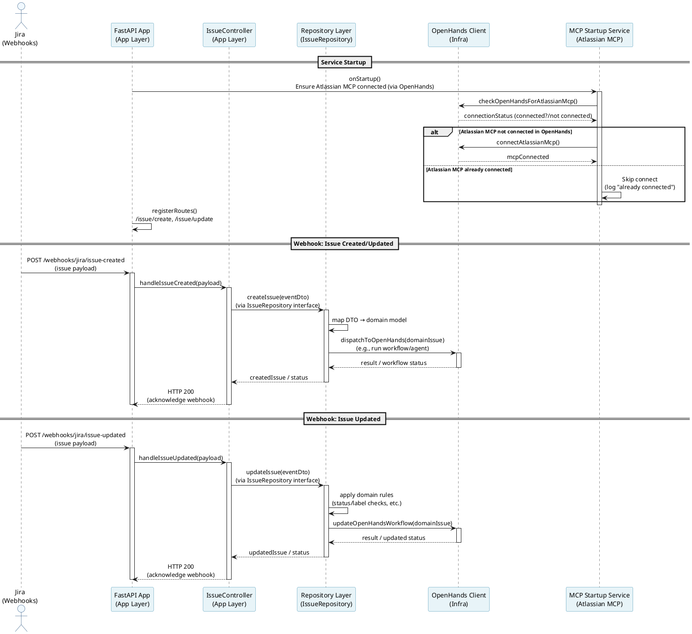
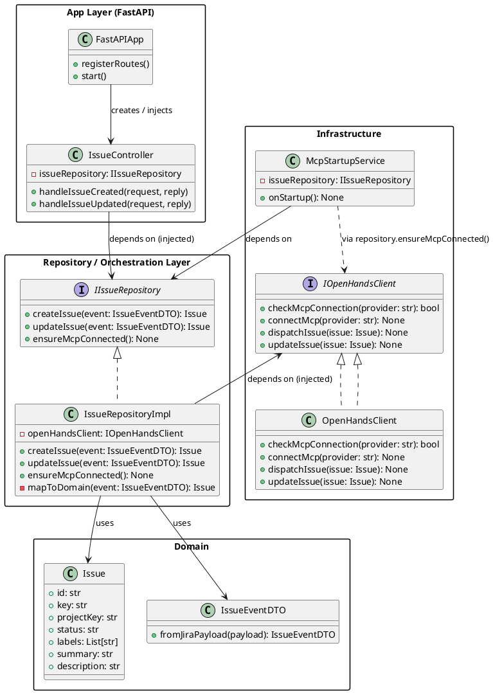

## Project Architecture

This document describes the high-level code architecture of the AI Orchestrator service that:

- Accepts Jira webhooks for issue changes.
- Uses an **app layer** (FastAPI) to expose HTTP routes.
- Uses a **repository/orchestration layer** to coordinate logic and connect to **OpenHands**.
- Manages **Atlassian MCP** connection to OpenHands via a dedicated startup service.

---

## Sequence Diagram – Startup & Webhook Handling

---

## Class Diagram – Layers & Dependencies

---

### Dependency Injection & Responsibilities

- **FastAPI app layer**
  - Owns HTTP server and route registration.
  - Injects `IIssueRepository` into `IssueController`.
- **Repository layer**
  - Implements `IIssueRepository` (`IssueRepositoryImpl`).
  - Orchestrates domain mapping and calls to `OpenHandsClient`.
  - Exposes `ensureMcpConnected()` used by `McpStartupService` to check/connect Atlassian MCP.
- **Infrastructure**
  - `OpenHandsClient` encapsulates all calls to OpenHands and MCP.
  - `McpStartupService` runs on startup, uses repository interface to ensure MCP connection before the app starts serving webhooks.

