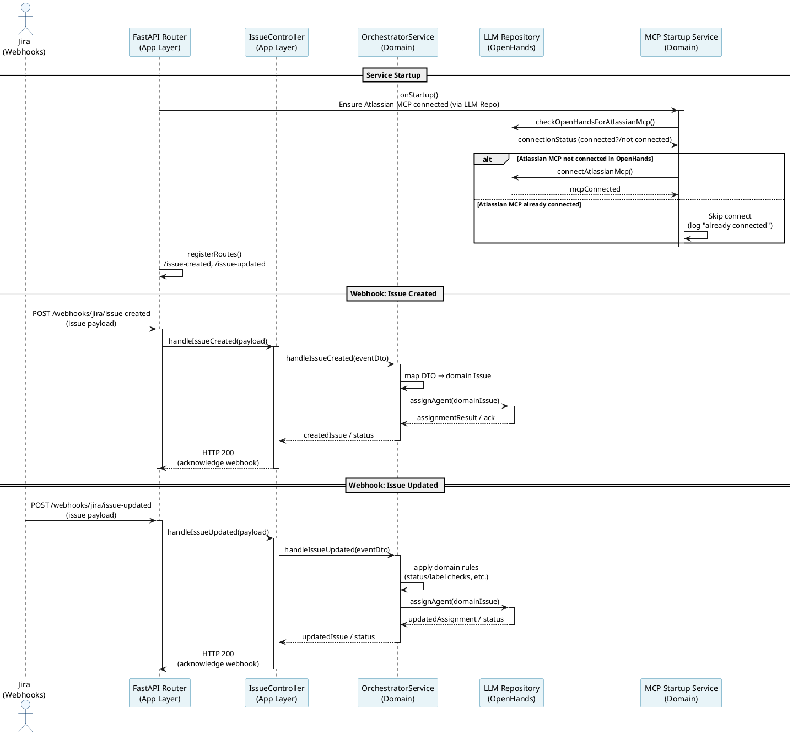
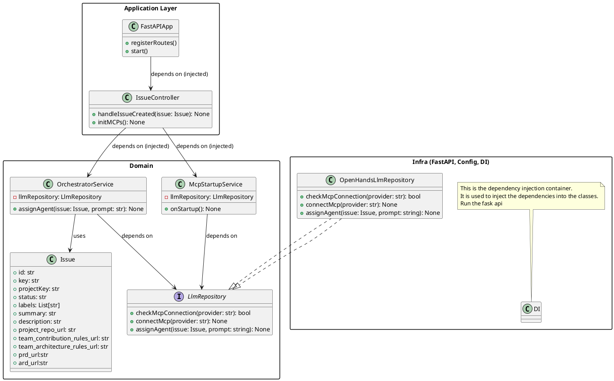

## Project Architecture

This document describes the high-level code architecture of the AI Orchestrator service that:

- Accepts Jira webhooks for issue changes.
- Uses an **app layer** (FastAPI) to expose HTTP routes.
- Uses a **repository/orchestration layer** to coordinate logic and connect to **OpenHands**.
- Manages **Atlassian MCP** connection to OpenHands via a dedicated startup service.

---

## Sequence Diagram – Startup & Webhook Handling

---

## Class Diagram – Layers & Dependencies

---

### Dependency Injection & Responsibilities

- **App layer**
  - Contains HTTP endpoints and controllers that translate Jira webhook payloads into `IssueEventDTO` domain objects.
  - Does **not** talk to OpenHands directly; it only depends on the domain `OrchestratorService`.
- **Domain layer**
  - Owns core domain models (`Issue`, `IssueEventDTO`), the `LlmRepository` interface, and services `OrchestratorService` and `McpStartupService`.
  - `OrchestratorService` takes domain `Issue` objects and calls `LlmRepository.assignAgent(issue)` for both created and updated hooks.
  - `McpStartupService` ensures Atlassian MCP is connected at startup via `LlmRepository.checkMcpConnection` / `connectMcp`.
- **Infra layer**
  - Hosts the FastAPI application (`FastAPIApp`), configuration, and dependency injection wiring.
  - Provides `OpenHandsLlmRepository` as the concrete `LlmRepository` implementation, encapsulating all calls to OpenHands and Atlassian MCP.
  - On startup, wires `McpStartupService` (from the domain layer) to ensure MCP is connected before serving requests.

